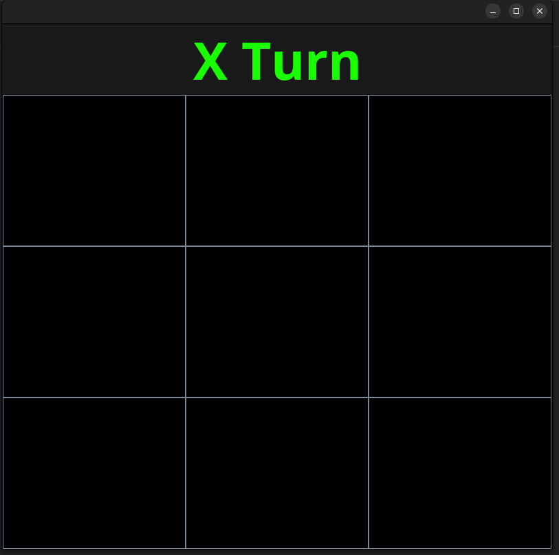

## TicTacToe in Java
This is a Simple TicTacToe game implemented in Java.




## Dependencies

To run this make sure you have the lates Open-JDK installed on to your system.

To check if you have Java installed Run:

```terminal
java --version
